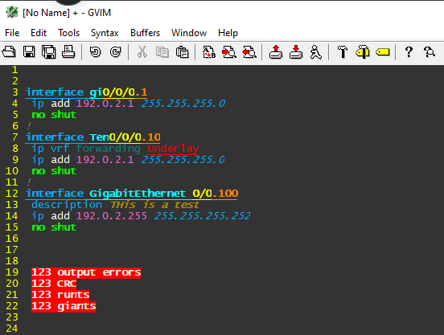
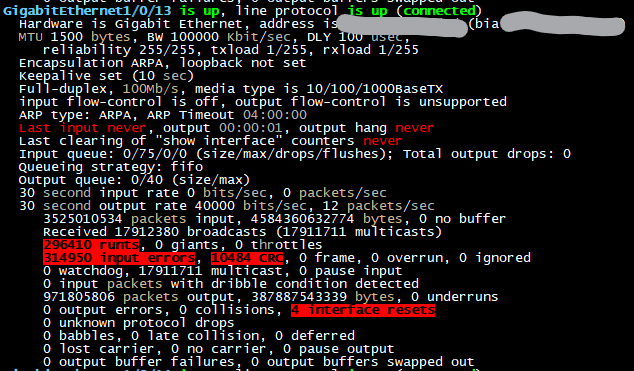
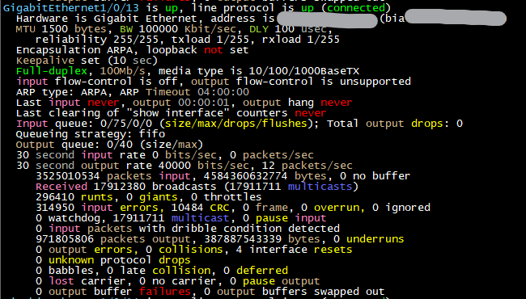
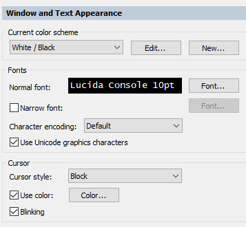
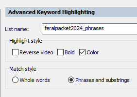
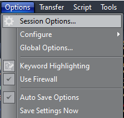
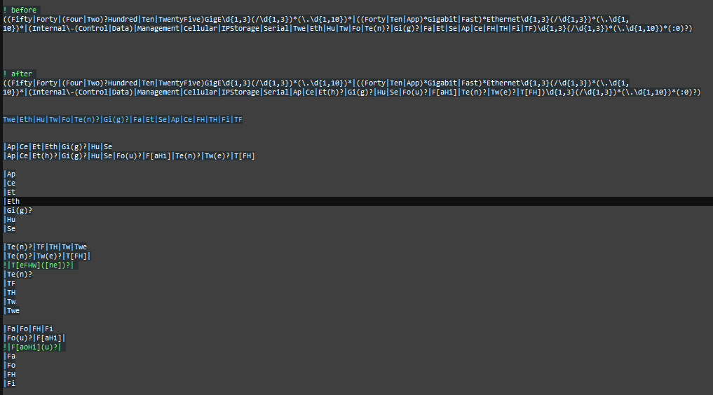
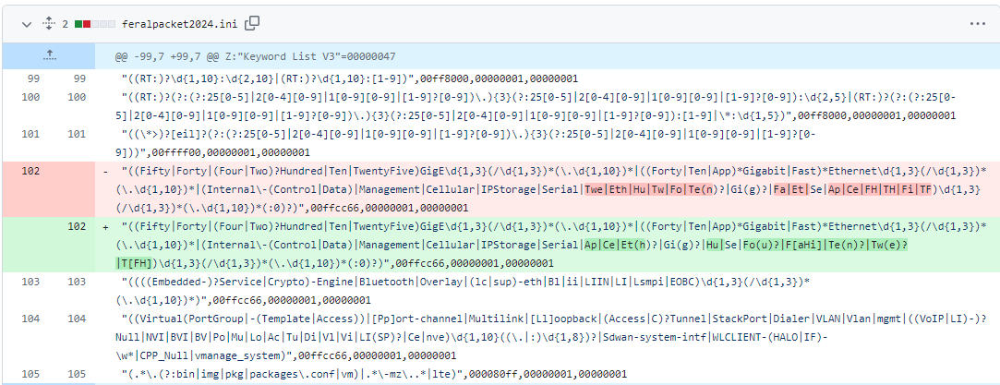

# securecrt-keyword-highlighting

## New:

### Phrases and substrings

I've been using VIMs syntax highlighting for Cisco for quite a while.  I feel it's one of the better ways of looking at offline configuration files when looking for typos.  The regex is more advanced then what is available with SecureCRT.  Groups can be used for things such interfaces where the interface name matches one regex, a next group can be called to match the interface shelf / module / number, and then a third group can be called to match sub-interfaces.  And each group is given a different color.  I've tried multiple times and haven't been able to get this to work in SecureCRT.

https://www.vim.org/scripts/script.php?script_id=4624

One thing I did notice is this syntax configuration can match non-zero error counters from the output of "show interface".  Wait, I can do that.



I'd avoided using the "Phases and substrings" feature in SecureCRT because I knew I'd have to completely rewrite the regex I was using.  But now I have a reason.

One of the problems of syntax highlighting is matching or coloring too much.  It can be overdone and ruin the entire point of it, to highlight important things.  I keep adding more and more regex to match more and more things.  But even I was noticing the result of what I was doing was becoming a little too much.  Compare these two screenshots.  Being about to match on non-zero error counters makes it easier to point out actual problems.





Uploaded **feralpacket2024_phrases.ini**.  Place in the usual spot in **%appdata%\VanDyke\Config\Keywords**.

**Note:**
 - Still some issues with matching route-targets.  Need to lab up L3VPN, L2VPN, and Inter-AS VPNs more.

**Settings:**
 - Terminal -> Apperance
   - Current color scheme:  White / Black
 - Terminal -> Advanced Keyword Highlighting
   - Highlight style:  select Color
   - Match style:  select Phrases and substrings





### Borked
At some point, the line Z:"Keyword List V2" ended up in the .ini files, twice.  Causes the files to be twice as long.  Also means only half the the regular expressions were being used, the bottom half.  Which was causing a lot of confusion for me.  Copied and pasted each regular expression line out and back into a new list name.

### Regular Expression Length
Starting with SecureCRT version 9.3, the length of the regular expression for each line was increased.  

**feralpacket2023.ini** ( and **feralpacket2024.ini** ) will start using longer regular expressions.  This will allow me to do some consolidation and reduce the number of lines.  Maybe, someday. 

Note, the regular expressions I had been using where up to 256 characters long.  **shrug**

From SecureCRT_HISTORY.TXT:

  > - Increased the character limit for keywords from 246 to 2048,
  >   which allows more complex regular expressions to be specified
  >  for keyword highlighting.


### My original blog post from 2016

**SecureCRT Text Highlighting**

https://feralpacket.org/?p=299

### Updated blog post from 2019

**Regular Expressions For SecureCRT Keyword Highlighting – Update**

https://feralpacket.org/?p=817


This contains an updated .ini file that I shared with the Routergods and Art of Network Engineering communities.

http://dentonj.freeshell.org/

## Making Changes

Every so often, someone emails me a version of an .ini file that they edited directly.  Please, don't do that.  Not only do you have to consider whether your regex changes actually worked.  But you also have to make sure you didn't mess up the format of the .ini file.  Make any changes inside of the app.

There are multiple was of getting there.  But there is only one .ini file or list name that you are editing.  My preferred way is through **Options -> Session Options.**



Then go to **Terminal -> Keyword Highlighting**.  Click on the line you want to edit to get the **Edit Keyword** box.  You can make changes here, but I don't recommend it.  Copy the line to a text file and make the changes there.  


I have a **! before** section with the regex before I start making changes.  There have been times my changes ended up not working and I just made a mess.  If that happens, you can copy the before state of the regex back.

I have an **! after** section.  This is were I make my changes.  Sometimes, I'll have several versions or copies of the same regex I'm changing.  For some of the more complicated regex, I break them out below this section.  I separate each regex with the associated "|".  This makes it easier to read.

Here are my notes from when I realized that FourHunderdGigE interfaces used "Fou" for the short version of the interface name.  I also used this addition as a good time to clean up the regex.



As a code block:

```
! before
((Fifty|Forty|(Four|Two)?Hundred|Ten|TwentyFive)GigE\d{1,3}(/\d{1,3})*(\.\d{1,10})*|((Forty|Ten|App)*Gigabit|Fast)*Ethernet\d{1,3}(/\d{1,3})*(\.\d{1,10})*|(Internal\-(Control|Data)|Management|Cellular|IPStorage|Serial|Twe|Eth|Hu|Tw|Fo|Te(n)?|Gi(g)?|Fa|Et|Se|Ap|Ce|FH|TH|Fi|TF)\d{1,3}(/\d{1,3})*(\.\d{1,10})*(:0)?)

! after
((Fifty|Forty|(Four|Two)?Hundred|Ten|TwentyFive)GigE\d{1,3}(/\d{1,3})*(\.\d{1,10})*|((Forty|Ten|App)*Gigabit|Fast)*Ethernet\d{1,3}(/\d{1,3})*(\.\d{1,10})*|(Internal\-(Control|Data)|Management|Cellular|IPStorage|Serial|Ap|Ce|Et(h)?|Gi(g)?|Hu|Se|Fo(u)?|F[aHi]|Te(n)?|Tw(e)?|T[FH])\d{1,3}(/\d{1,3})*(\.\d{1,10})*(:0)?)

Twe|Eth|Hu|Tw|Fo|Te(n)?|Gi(g)?|Fa|Et|Se|Ap|Ce|FH|TH|Fi|TF

|Ap|Ce|Et|Eth|Gi(g)?|Hu|Se
|Ap|Ce|Et(h)?|Gi(g)?|Hu|Se|Fo(u)?|F[aHi]|Te(n)?|Tw(e)?|T[FH]

|Ap
|Ce
|Et
|Eth
|Gi(g)?
|Hu
|Se

|Te(n)?|TF|TH|Tw|Twe
|Te(n)?|Tw(e)?|T[FH]|
!|T[eFHW]([ne])?|
|Te(n)?
|TF
|TH
|Tw
|Twe

|Fa|Fo|FH|Fi
|Fo(u)?|F[aHi]|
!|F[aoHi](u)?|
|Fa
|Fo
|FH
|Fi
```

When you are done with your changes, copy your new regex back into the **Edit Keyword** box and save.  Then check to see if the chanes you wanted took affect.  Sometimes you have to scroll the text off of the screen and back before the changes highlight the new text.

Because your changes are made to the .ini file, any sessions that uses that .ini file or list name will have the updated changes.  You don't need to change the Default Session.

The changes I made to **feralpacket2024.ini** for the new interface short name.



Testing hint:  You don't need to have the proper show command to test your changes.  If you know what the text that you want highlighted should look like, just type it in at the cli.


## FAQ

### I copied your regex into another terminal program and it didn't work.

Yeap.  I use the **Whole Words** feature in SecureCRT.  This means, I don't have to specify word boundaries in my regex.  In addition, white space and the following characters are used as word boundaries:  ` ~!#$%^&*()+=:;<>,.?/\[]{}|'  This means, I have to escape any of those characters to match them.  And I'm unable to to create a regex that matches across white space.  Quite a few other terminal applications allow you to match regex across white space.  And they don't use those characters as word boundaries.  You'll have to specify word boundaries with your regex.  And you'll have to remove any escapes I use in my regex.  What does that mean?  If you copy and paste my regex into some terminal program other than SecureCRT, it probably will not work.
